![ESP32 PlatformIO](https://img.shields.io/badge/ESP32-PlatformIO-orange?logo=data%3Aimage%2Fsvg%2Bxml%3Bbase64%2CPHN2ZyB3aWR0aD0iMjUwMCIgaGVpZ2h0PSIyNTAwIiB2aWV3Qm94PSIwIDAgMjU2IDI1NiIgeG1sbnM9Imh0dHA6Ly93d3cudzMub3JnLzIwMDAvc3ZnIiBwcmVzZXJ2ZUFzcGVjdFJhdGlvPSJ4TWlkWU1pZCI+PHBhdGggZD0iTTEyOCAwQzkzLjgxIDAgNjEuNjY2IDEzLjMxNCAzNy40OSAzNy40OSAxMy4zMTQgNjEuNjY2IDAgOTMuODEgMCAxMjhjMCAzNC4xOSAxMy4zMTQgNjYuMzM0IDM3LjQ5IDkwLjUxQzYxLjY2NiAyNDIuNjg2IDkzLjgxIDI1NiAxMjggMjU2YzM0LjE5IDAgNjYuMzM0LTEzLjMxNCA5MC41MS0zNy40OUMyNDIuNjg2IDE5NC4zMzQgMjU2IDE2Mi4xOSAyNTYgMTI4YzAtMzQuMTktMTMuMzE0LTY2LjMzNC0zNy40OS05MC41MUMxOTQuMzM0IDEzLjMxNCAxNjIuMTkgMCAxMjggMCIgZmlsbD0iI0ZGN0YwMCIvPjxwYXRoIGQ9Ik0yNDkuMzg2IDEyOGMwIDY3LjA0LTU0LjM0NyAxMjEuMzg2LTEyMS4zODYgMTIxLjM4NkM2MC45NiAyNDkuMzg2IDYuNjEzIDE5NS4wNCA2LjYxMyAxMjggNi42MTMgNjAuOTYgNjAuOTYgNi42MTQgMTI4IDYuNjE0YzY3LjA0IDAgMTIxLjM4NiA1NC4zNDYgMTIxLjM4NiAxMjEuMzg2IiBmaWxsPSIjRkZGIi8+PHBhdGggZD0iTTE2MC44NjkgNzQuMDYybDUuMTQ1LTE4LjUzN2M1LjI2NC0uNDcgOS4zOTItNC44ODYgOS4zOTItMTAuMjczIDAtNS43LTQuNjItMTAuMzItMTAuMzItMTAuMzJzLTEwLjMyIDQuNjItMTAuMzIgMTAuMzJjMCAzLjc1NSAyLjAxMyA3LjAzIDUuMDEgOC44MzdsLTUuMDUgMTguMTk1Yy0xNC40MzctMy42Ny0yNi42MjUtMy4zOS0yNi42MjUtMy4zOWwtMi4yNTggMS4wMXYxNDAuODcybDIuMjU4Ljc1M2MxMy42MTQgMCA3My4xNzctNDEuMTMzIDczLjMyMy04NS4yNyAwLTMxLjYyNC0yMS4wMjMtNDUuODI1LTQwLjU1NS01Mi4xOTd6TTE0Ni41MyAxNjQuOGMtMTEuNjE3LTE4LjU1Ny02LjcwNi02MS43NTEgMjMuNjQzLTY3LjkyNSA4LjMyLTEuMzMzIDE4LjUwOSA0LjEzNCAyMS41MSAxNi4yNzkgNy41ODIgMjUuNzY2LTM3LjAxNSA2MS44NDUtNDUuMTUzIDUxLjY0NnptMTguMjE2LTM5Ljc1MmE5LjM5OSA5LjM5OSAwIDAgMC05LjM5OSA5LjM5OSA5LjM5OSA5LjM5OSAwIDAgMCA5LjQgOS4zOTkgOS4zOTkgOS4zOTkgMCAwIDAgOS4zOTgtOS40IDkuMzk5IDkuMzk5IDAgMCAwLTkuMzk5LTkuMzk4em0yLjgxIDguNjcyYTIuMzc0IDIuMzc0IDAgMSAxIDAtNC43NDkgMi4zNzQgMi4zNzQgMCAwIDEgMCA0Ljc0OXoiIGZpbGw9IiNFNTcyMDAiLz48cGF0aCBkPSJNMTAxLjM3MSA3Mi43MDlsLTUuMDIzLTE4LjkwMWMyLjg3NC0xLjgzMiA0Ljc4Ni01LjA0IDQuNzg2LTguNzAxIDAtNS43LTQuNjItMTAuMzItMTAuMzItMTAuMzItNS42OTkgMC0xMC4zMTkgNC42Mi0xMC4zMTkgMTAuMzIgMCA1LjY4MiA0LjU5MiAxMC4yODkgMTAuMjY3IDEwLjMxN0w5NS44IDc0LjM3OGMtMTkuNjA5IDYuNTEtNDAuODg1IDIwLjc0Mi00MC44ODUgNTEuODguNDM2IDQ1LjAxIDU5LjU3MiA4NS4yNjcgNzMuMTg2IDg1LjI2N1Y2OC44OTJzLTEyLjI1Mi0uMDYyLTI2LjcyOSAzLjgxN3ptMTAuMzk1IDkyLjA5Yy04LjEzOCAxMC4yLTUyLjczNS0yNS44OC00NS4xNTQtNTEuNjQ1IDMuMDAyLTEyLjE0NSAxMy4xOS0xNy42MTIgMjEuNTExLTE2LjI4IDMwLjM1IDYuMTc1IDM1LjI2IDQ5LjM2OSAyMy42NDMgNjcuOTI2em0tMTguODItMzkuNDZhOS4zOTkgOS4zOTkgMCAwIDAtOS4zOTkgOS4zOTggOS4zOTkgOS4zOTkgMCAwIDAgOS40IDkuNCA5LjM5OSA5LjM5OSAwIDAgMCA5LjM5OC05LjQgOS4zOTkgOS4zOTkgMCAwIDAtOS4zOTktOS4zOTl6bS0yLjgxIDguNjcxYTIuMzc0IDIuMzc0IDAgMSAxIDAtNC43NDggMi4zNzQgMi4zNzQgMCAwIDEgMCA0Ljc0OHoiIGZpbGw9IiNGRjdGMDAiLz48L3N2Zz4=)  

# Wokwi pour Visual Studio Code

- [Wokwi pour Visual Studio Code](#wokwi-pour-visual-studio-code)
  - [Wokwi](#wokwi)
  - [Installation](#installation)
    - [Visual Studio Code](#visual-studio-code)
    - [PlatformIO](#platformio)
    - [Installation extension Wokwi](#installation-extension-wokwi)
  - [Simulation d'un projet embarqué](#simulation-dun-projet-embarqué)
    - [Arduino](#arduino)
      - [Étape n°1 : projet PlatformIO](#étape-n1--projet-platformio)
      - [Étape n°2 : simulation avec Wokwi](#étape-n2--simulation-avec-wokwi)
    - [ESP32](#esp32)
    - [Raspberry Pi Pico (MicroPython)](#raspberry-pi-pico-micropython)
  - [Glossaire](#glossaire)
      - [Simulateur](#simulateur)
      - [Prototype](#prototype)
      - [Système embarqué](#système-embarqué)
      - [Microcontrôleur](#microcontrôleur)
      - [IdO ou IoT](#ido-ou-iot)
  - [Voir aussi](#voir-aussi)
  - [Auteur](#auteur)


## Wokwi

**Wokwi** est un simulateur pour les systèmes embarqués et les appareils IdO (IoT).

Il fournit un environnement en ligne où vous pouvez configurer, déboguer et partager des projets de systèmes embarqués sans avoir besoin de matériel.

Le simulateur fonctionne simplement dans un navigateur web et peut simuler beaucoup de familles de microcontrôleurs.

Lien : [https://wokwi.com/](https://wokwi.com/)

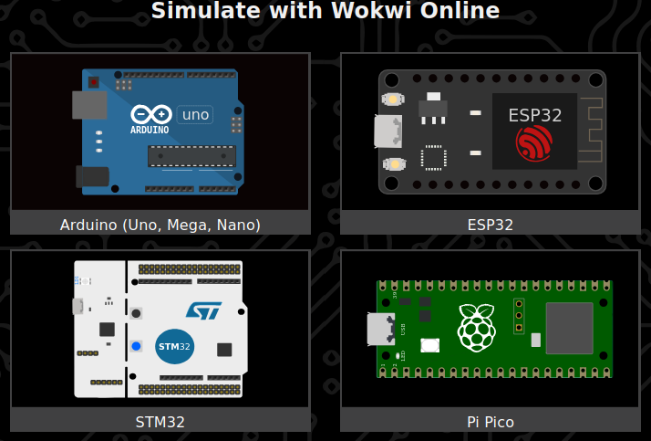

Ressources :

- [https://docs.wokwi.com/](https://docs.wokwi.com/?utm_source=wokwi)
- [https://docs.wokwi.com/getting-started/supported-hardware](https://docs.wokwi.com/getting-started/supported-hardware)
- [https://docs.wokwi.com/guides/libraries](https://docs.wokwi.com/guides/libraries)

[Wokwi pour Visual Studio Code](https://docs.wokwi.com/vscode/getting-started) fournit une solution de simulation intègrée à cet environnement de développement.

On présente ici l'utilisation du simulateur **Wokwi** en local avec les outils [Visual Studio Code](https://code.visualstudio.com/) et [PlatformIO](https://platformio.org/) :

- [Visual Studio Code](https://code.visualstudio.com/) (ou VSCode) est un éditeur de code source extensible et disponible pour Windows, macOS et Linux. On peut le classer dans la catégorie des EDI (Environnement de Développement Intégré) ou IDE (_Integrated Development Environment_) en anglais.
- [PlatformIO](https://platformio.org/) est un écosystème open source dédié au développement IoT qui va faciliter le développement embarqué professionnel. [PlatformIO IDE](https://platformio.org/platformio-ide) est l'environnement de développement C/C++ pour les systèmes embarqués supportés. Il est multi-plateformes (Windows, Mac et GNU/Linux) et il fournit une [extension](https://platformio.org/install/ide?install=vscode) à [Visual Studio Code](https://code.visualstudio.com/).

## Installation

### Visual Studio Code

Liens :

- [Download VSCode](https://code.visualstudio.com/Download)
- [Installing VSCode on Linux](https://code.visualstudio.com/docs/setup/linux)
- [Installing PlatformIO IDE for VSCode](https://platformio.org/install/ide?install=vscode)

Étapes sous Debian/Ubuntu :

- Installer VSCode

Pré-requis :

```sh
sudo apt-get install wget gpg
sudo apt-get install apt-transport-https
```

Solution n°1 :

```sh
wget -c https://update.code.visualstudio.com/latest/linux-deb-x64/stable
sudo apt install stable
rm -f stable
```

Solution n°2 :

```sh
wget -qO- https://packages.microsoft.com/keys/microsoft.asc | gpg --dearmor > packages.microsoft.gpg
sudo install -D -o root -g root -m 644 packages.microsoft.gpg /etc/apt/keyrings/packages.microsoft.gpg
echo "deb [arch=amd64,arm64,armhf signed-by=/etc/apt/keyrings/packages.microsoft.gpg] https://packages.microsoft.com/repos/code stable main" |sudo tee /etc/apt/sources.list.d/vscode.list > /dev/null
rm -f packages.microsoft.gpg

sudo apt-get update
sudo apt-get install code
```

### PlatformIO

Lien : [PlatformIO IDE for VSCode](https://docs.platformio.org/en/latest/integration/ide/vscode.html)

Démarrer VSCode

Aller dans File &rarr; Preferences &rarr; Extensions

Rechercher le _package_ `platformio-ide` et l'installer

On obtient :

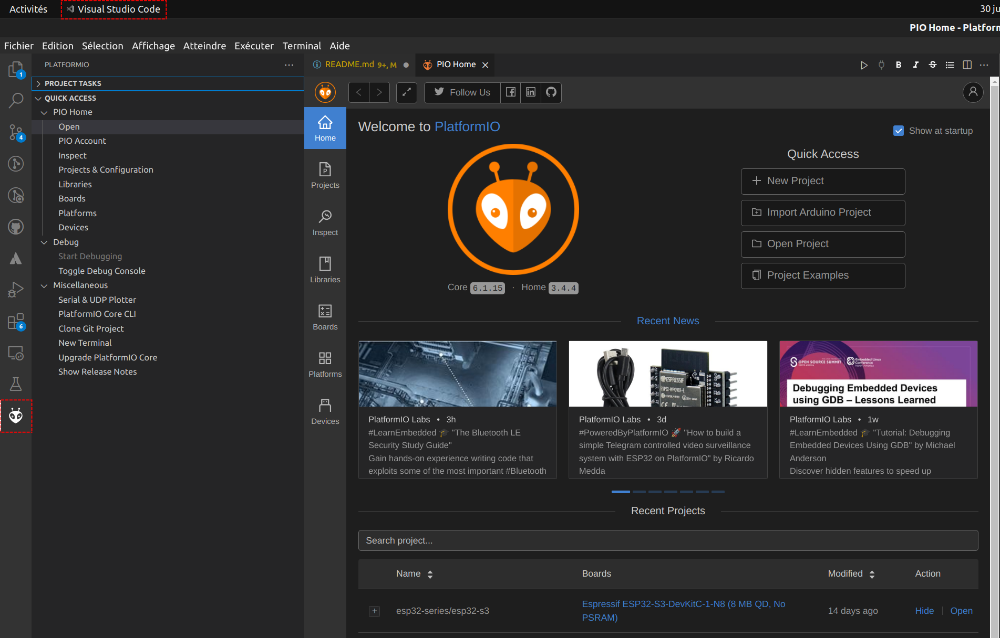

### Installation extension Wokwi

Lien : [Wokwi for VS Code](https://docs.wokwi.com/vscode/getting-started)

Démarrer VSCode

Aller dans File &rarr; Preferences &rarr; Extensions

Rechercher le _package_ `wokwi-vscode` et l'installer

Il faut un compte (gratuit) sur [wokwi.com](https://wokwi.com/). Il est possible de s'authentifier avec son compte _google_ ou _github_ :

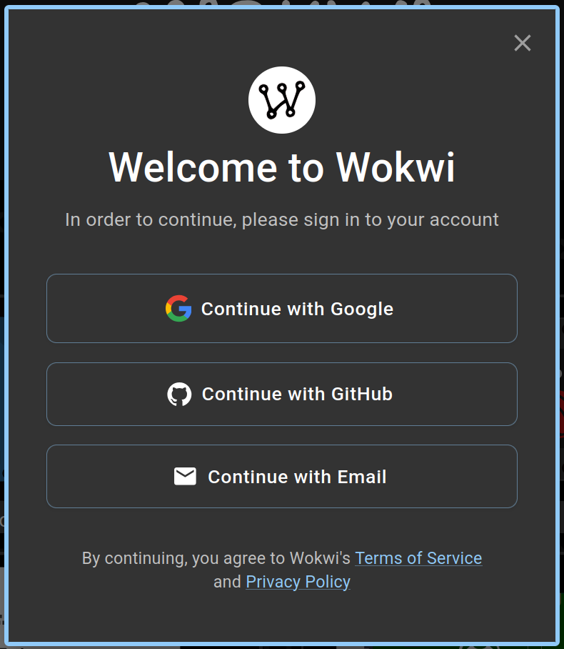

Aller dans Affichage &rarr; Palette de commandes (Ctrl+Maj+P) :

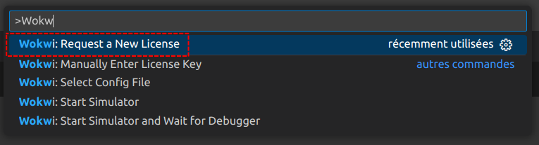

Cliquer sur Ouvrir :

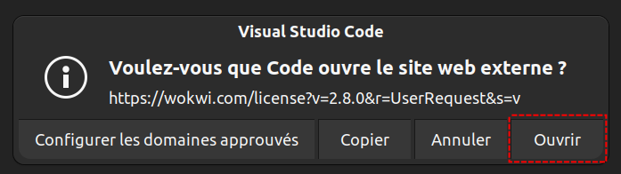

Dans le navigateur, cliquer sur `GET YOUR LICENCE` :

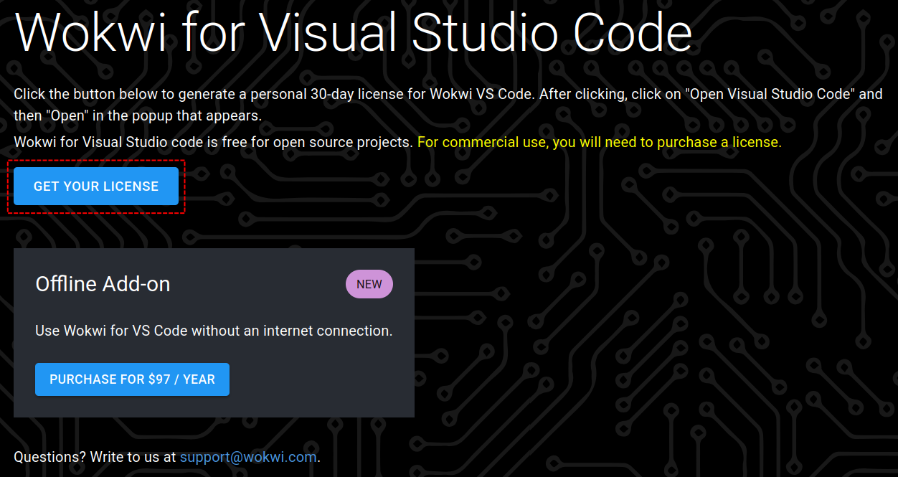

Cliquer sur Ouvrir (ou copier/coller manuellement):

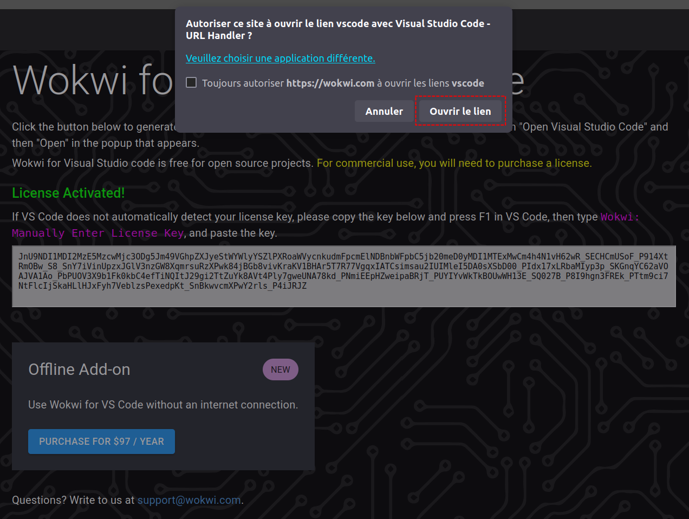

> ⚠️ Pour utiliser le simulateur (gratuitement) en local avec VSCode, il faut une connexion Internet.

## Simulation d'un projet embarqué

### Arduino

On va simuler un projet construit autour d'une carte [Arduino Uno](https://docs.arduino.cc/hardware/uno-rev3/) et d'un accéléromètre [MPU 6050](https://www.gotronic.fr/art-module-6-dof-sen-mpu6050-31492.htm).

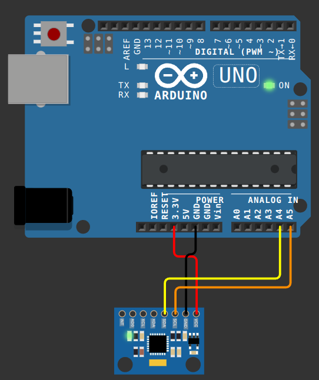

#### Étape n°1 : projet PlatformIO

Avant de simuler le projet, il faut préalablement compiler le code pour générer les fichier _firmware_ et ELF.

Dans VSCode, cliquer sur l'icône PlatformIO :


Il faut ensuite soit créer un nouveau projet soit ouvrir un projet existant :

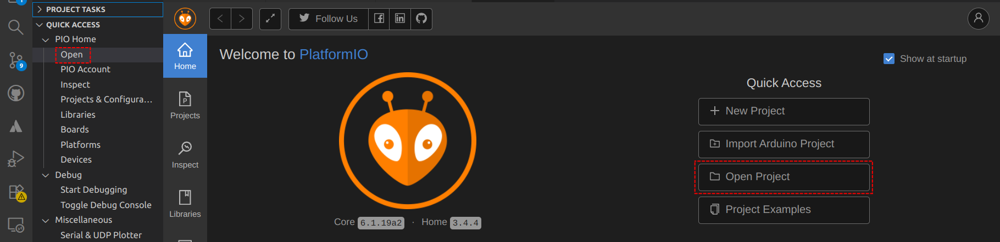

Ici, on va ouvrir le projet qui se situe dans `src/arduino-uno`.

> Un "projet" PlatformIo est un répertoire qui possède le fichier `platformio.ini` qui contient la description du "projet".

L'ouverture du projet fait apparaître des icônes spécifiques à PlatormIO dans la barre d'état. Pour fabriquer le projet, il faut cliquer ici :


Les résultats de la fabrication apparaissent dans un terminal :

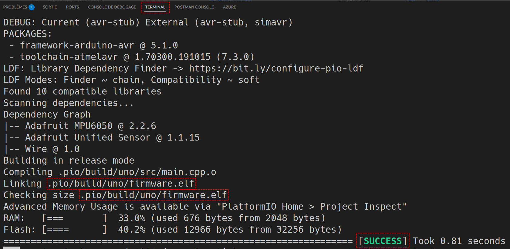

Il est possible d'utiliser l'outil de PlatformIO en ligne de commande (CLI). Pour cela, il faut ouvrir un terminal PlatormIO (l'icône dans la barre d'état ci-dessous) et exécuter ensuite la commande `platformio run` :

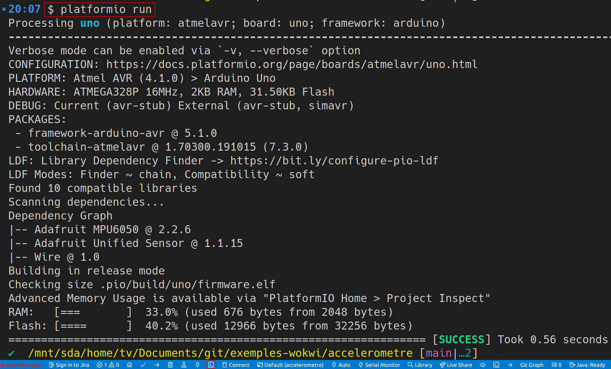

```sh
$ platformio run
Processing uno (platform: atmelavr; board: uno; framework: arduino)
--------------------------------------------------------------------------------------------------------------------------------------------------------------
Verbose mode can be enabled via `-v, --verbose` option
CONFIGURATION: https://docs.platformio.org/page/boards/atmelavr/uno.html
PLATFORM: Atmel AVR (4.1.0) > Arduino Uno
HARDWARE: ATMEGA328P 16MHz, 2KB RAM, 31.50KB Flash
DEBUG: Current (avr-stub) External (avr-stub, simavr)
PACKAGES: 
 - framework-arduino-avr @ 5.1.0 
 - toolchain-atmelavr @ 1.70300.191015 (7.3.0)
LDF: Library Dependency Finder -> https://bit.ly/configure-pio-ldf
LDF Modes: Finder ~ chain, Compatibility ~ soft
Found 10 compatible libraries
Scanning dependencies...
Dependency Graph
|-- Adafruit MPU6050 @ 2.2.6
|-- Adafruit Unified Sensor @ 1.1.15
|-- Wire @ 1.0
Building in release mode
Compiling .pio/build/uno/src/main.cpp.o
Compiling .pio/build/uno/lib462/Wire/Wire.cpp.o
Compiling .pio/build/uno/lib462/Wire/utility/twi.c.o
Compiling .pio/build/uno/libfbf/SPI/SPI.cpp.o
Compiling .pio/build/uno/lib064/Adafruit BusIO/Adafruit_BusIO_Register.cpp.o
Compiling .pio/build/uno/lib064/Adafruit BusIO/Adafruit_GenericDevice.cpp.o
Compiling .pio/build/uno/lib064/Adafruit BusIO/Adafruit_I2CDevice.cpp.o
Compiling .pio/build/uno/lib064/Adafruit BusIO/Adafruit_SPIDevice.cpp.o
Compiling .pio/build/uno/lib536/Adafruit Unified Sensor/Adafruit_Sensor.cpp.o
Compiling .pio/build/uno/libdf9/Adafruit MPU6050/Adafruit_MPU6050.cpp.o
Archiving .pio/build/uno/lib462/libWire.a
Archiving .pio/build/uno/libfbf/libSPI.a
Indexing .pio/build/uno/lib462/libWire.a
Indexing .pio/build/uno/libfbf/libSPI.a
Archiving .pio/build/uno/libFrameworkArduinoVariant.a
Indexing .pio/build/uno/libFrameworkArduinoVariant.a
Compiling .pio/build/uno/FrameworkArduino/CDC.cpp.o
Compiling .pio/build/uno/FrameworkArduino/HardwareSerial.cpp.o
Compiling .pio/build/uno/FrameworkArduino/HardwareSerial0.cpp.o
Archiving .pio/build/uno/lib536/libAdafruit Unified Sensor.a
Archiving .pio/build/uno/lib064/libAdafruit BusIO.a
Indexing .pio/build/uno/lib536/libAdafruit Unified Sensor.a
Indexing .pio/build/uno/lib064/libAdafruit BusIO.a
Compiling .pio/build/uno/FrameworkArduino/HardwareSerial1.cpp.o
Compiling .pio/build/uno/FrameworkArduino/HardwareSerial2.cpp.o
Compiling .pio/build/uno/FrameworkArduino/HardwareSerial3.cpp.o
Compiling .pio/build/uno/FrameworkArduino/IPAddress.cpp.o
Compiling .pio/build/uno/FrameworkArduino/PluggableUSB.cpp.o
Compiling .pio/build/uno/FrameworkArduino/Print.cpp.o
Archiving .pio/build/uno/libdf9/libAdafruit MPU6050.a
Indexing .pio/build/uno/libdf9/libAdafruit MPU6050.a
Compiling .pio/build/uno/FrameworkArduino/Stream.cpp.o
Compiling .pio/build/uno/FrameworkArduino/Tone.cpp.o
Compiling .pio/build/uno/FrameworkArduino/USBCore.cpp.o
Compiling .pio/build/uno/FrameworkArduino/WInterrupts.c.o
Compiling .pio/build/uno/FrameworkArduino/WMath.cpp.o
Compiling .pio/build/uno/FrameworkArduino/WString.cpp.o
Compiling .pio/build/uno/FrameworkArduino/abi.cpp.o
Compiling .pio/build/uno/FrameworkArduino/hooks.c.o
Compiling .pio/build/uno/FrameworkArduino/main.cpp.o
Compiling .pio/build/uno/FrameworkArduino/new.cpp.o
Compiling .pio/build/uno/FrameworkArduino/wiring.c.o
Compiling .pio/build/uno/FrameworkArduino/wiring_analog.c.o
Compiling .pio/build/uno/FrameworkArduino/wiring_digital.c.o
Compiling .pio/build/uno/FrameworkArduino/wiring_pulse.S.o
Compiling .pio/build/uno/FrameworkArduino/wiring_pulse.c.o
Compiling .pio/build/uno/FrameworkArduino/wiring_shift.c.o
Archiving .pio/build/uno/libFrameworkArduino.a
Indexing .pio/build/uno/libFrameworkArduino.a
Linking .pio/build/uno/firmware.elf
Checking size .pio/build/uno/firmware.elf
Advanced Memory Usage is available via "PlatformIO Home > Project Inspect"
RAM:   [===       ]  33.0% (used 676 bytes from 2048 bytes)
Flash: [====      ]  40.2% (used 12966 bytes from 32256 bytes)
Building .pio/build/uno/firmware.hex
================================================================ [SUCCESS] Took 1.07 seconds ================================================================
```

L'opération de fabrication s'est exécutée avec `SUCCESS` et les fichiers _firmware_ et ELF ont été générés :

- _firmware_ : `.pio/build/uno/firmware.hex`
- ELF : `.pio/build/uno/firmware.elf`

#### Étape n°2 : simulation avec Wokwi

Pour simuler le projet sur Wokwi, il faut disposer de deux fichiers dans le répertoire racine du projet :

- `wokwi.toml` qui est le fichier de configuration qui indique à Wokwi comment exécuter le projet, ici :

```toml
[wokwi]
version = 1
elf = ".pio/build/uno/firmware.elf"
firmware = ".pio/build/uno/firmware.hex"
```

- `diagram.json` qui est le fichier de diagramme qui décrit le schéma du montage, ici :

```json
{
  "version": 1,
  "author": "Uri Shaked",
  "editor": "wokwi",
  "parts": [
    { "type": "wokwi-arduino-uno", "id": "uno", "top": 0, "left": 0, "attrs": {} },
    { "type": "wokwi-mpu6050", "id": "mpu1", "top": 264.52, "left": 96.05, "attrs": {} }
  ],
  "connections": [
    [ "uno:3.3V", "mpu1:VCC", "red", [ "v27", "h29" ] ],
    [ "uno:GND.2", "mpu1:GND", "black", [ "v25", "h66" ] ],
    [ "uno:A5", "mpu1:SCL", "darkorange", [ "v55", "h-105" ] ],
    [ "uno:A4", "mpu1:SDA", "yellow", [ "v47", "h-95" ] ]
  ]
}
```

Pour éditer le schéma du montage, il suffit de cliquer sur le fichier `diagram.json` :

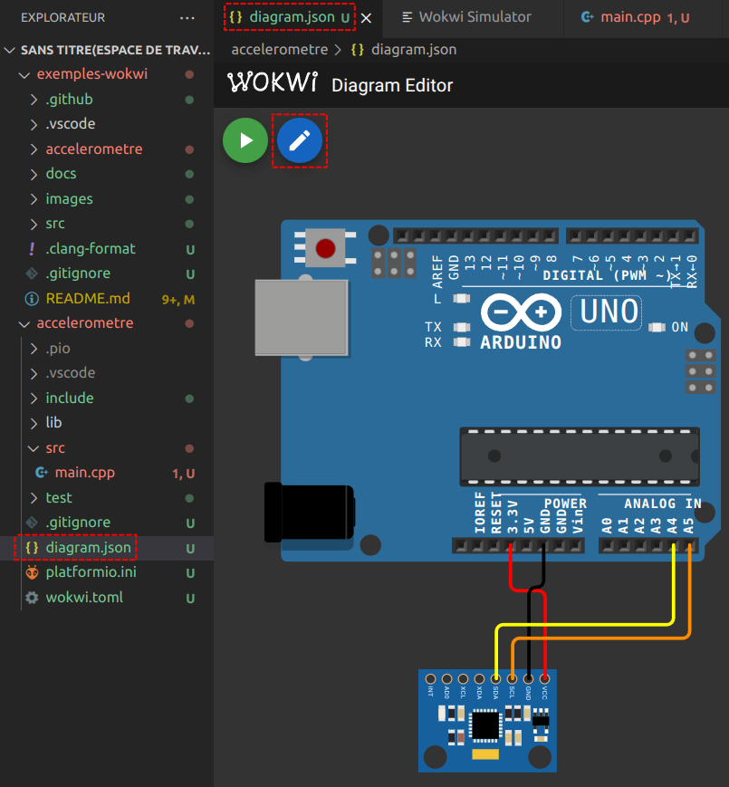

> 👎 Malheureusement, cette fonctionnalité est réservée au plan payant. Il faut donc éditer le fichier `diagram.json` manuellement. On peut copier/coller le contenu de ce fichier à partir d'un projet de l'environnment en ligne https://wokwi.com/.

Pour simuler le projet, il suffit de cliquer sur la flèche verte :

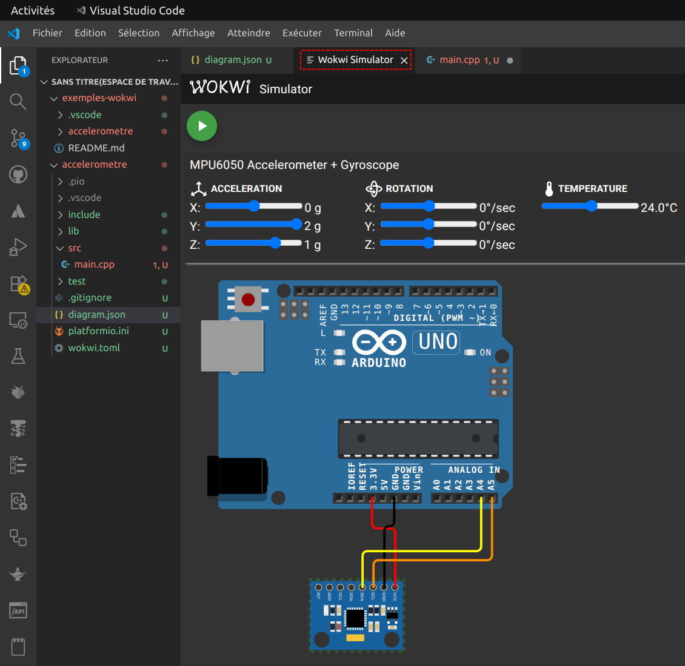

> Pour simuler le fonctionnement de l'accéléromètre, il suffit de cliquer sur le composant et de vaire varier manuellement les valeurs de l'accélaration X, Y et/ou Z.

Si des affichages de _debug_ sont utilisés dans le code du projet (avec `Serial.println()` et/ou `Serial.print()`), ils apparaissent alors dans le terminal :

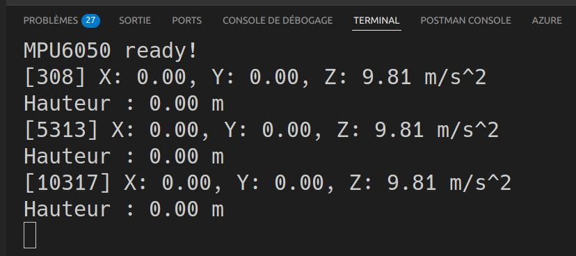

### ESP32

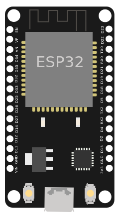

Lien : [ESP32 Simulation](https://docs.wokwi.com/guides/esp32)

L'[ESP32](http://esp32.net/) est un microcontrôleur (WiFi et Bluetooth intégrés) largement utilisé pour les projets IoT. Wokwi simule l'ESP32, ESP32-C3, ESP32-S2, ESP32-S3, ESP32-C6, ESP32-H2, et ESP32-P4 (bêta) :

- _Framework_ Arduino (C/C++) : [Arduino-ESP32 Project Template](https://wokwi.com/projects/new/esp32) (Exemple [blink](https://wokwi.com/projects/305452382231200320))
- MicroPython : [MicroPython ESP32 Project Template](https://wokwi.com/projects/new/micropython-esp32) (Exemple [blink](https://wokwi.com/projects/305452627045384768))

> Simulation en ligne : https://wokwi.com/esp32

On va simuler un projet basique construit autour d'un [ESP32](http://esp32.net/) :

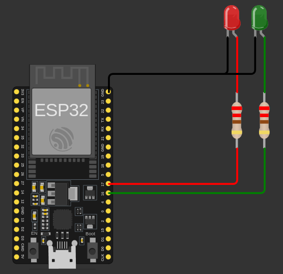

La procédure est la même que pour un projet [Arduino](#arduino).

Le fichier de configuration `wokwi.toml` :

```toml
[wokwi]
version = 1
elf = ".pio/build/esp32dev/firmware.elf"
firmware = ".pio/build/esp32dev/firmware.elf"
```

Le code source est dans `src/esp32/`.

### Raspberry Pi Pico (MicroPython)

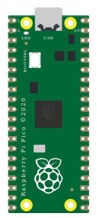

Lien : [wokwi-pi-pico Reference](https://docs.wokwi.com/parts/wokwi-pi-pico)

Le [Raspberry Pi Pico](https://www.raspberrypi.com/documentation/microcontrollers/pico-series.html) est un microcontrôleur [RP2040](https://www.raspberrypi.com/documentation/microcontrollers/silicon.html#rp2040) d'architecture ARM conçu par la fondation Raspberry Pi.

> Un nouveau modèle, le [Raspberry Pi Pico 2](https://www.raspberrypi.com/documentation/microcontrollers/pico-series.html#pico-2-family) est équipé du microcontrôleur [RP2350](https://www.raspberrypi.com/documentation/microcontrollers/silicon.html#rp2350).
> Simulation en ligne : https://wokwi.com/pi-pico

On va simuler un projet basique construit autour d'un [Raspberry Pi Pico](https://www.raspberrypi.com/documentation/microcontrollers/pico-series.html) programmé en [MicroPython](https://docs.wokwi.com/guides/micropython) :

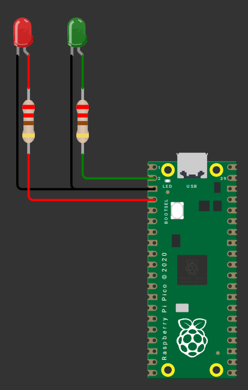

La procédure pour les projets utilisant [MicroPython](https://docs.wokwi.com/guides/micropython) est décrite ici : https://github.com/wokwi/wokwi-vscode-micropython

Le code source est dans `src/pico/`. Il doit contenir un fichier nommé `main.py`.

Le fichier de configuration `wokwi.toml` pour [MicroPython](https://docs.wokwi.com/guides/micropython) sur Raspberry Pi Pico :

```toml
[wokwi]
version = 1
firmware = "./rpi-pico-v1.26.1.uf2"
elf = "./rpi-pico-v1.26.1.uf2"
rfc2217ServerPort = 4000
```

> cf. [Firmware UF2](https://micropython.org/download/RPI_PICO/)

Il faut installer `mpremote` :

```sh
$ pip install mpremote
```

> L'outil de ligne de commande `mpremote` fournit un ensemble intégré d'utilitaires permettant d'interagir avec un périphérique MicroPython.

Démarrer la simulation puis exécuter la commande suivante :

```sh
$ mpremote connect port:rfc2217://localhost:4000 run main.py
```

## Glossaire

#### Simulateur

Un **simulateur** est un dispositif technique permettant de reproduire de façon virtuelle une situation.

#### Prototype

Dans le domaine de l'industrie et plus généralement de la recherche et développement (R&D), un **prototype** est selon la définition de l'OCDE « un modèle original qui possède toutes les qualités techniques et toutes les caractéristiques de fonctionnement d'un nouveau produit. (...) », mais il s'agit aussi parfois d'un exemplaire incomplet (et non définitif) de ce que pourra être un produit (éventuellement de type logiciel ou de type « service ») ou un objet matériel final.

#### Système embarqué

Un **système embarqué** est un système électronique et informatique autonome spécialisé dans une tâche précise.

Le terme désigne aussi bien le matériel informatique que le logiciel utilisé. Ses ressources sont généralement limitées spatialement (encombrement réduit) et énergétiquement (consommation restreinte).

#### Microcontrôleur

Un **microcontrôleur** (µc ou µC) est un circuit intégré qui rassemble les éléments essentiels d'un ordinateur : processeur, mémoires (mémoire morte et mémoire vive), unités périphériques et interfaces d'entrées-sorties.

Les microcontrôleurs se caractérisent par une plus faible consommation électrique et une vitesse de fonctionnement plus faible (de quelques mégahertz jusqu'à plus d'un gigahertz) et un coût réduit par rapport aux microprocesseurs utilisés dans les ordinateurs personnels.

Les microcontrôleurs sont fréquemment utilisés dans les systèmes embarqués.

#### IdO ou IoT

**IdO** (Internet des objets) ou IoT (_Internet of Things ou IoT_) est l'interconnexion entre l'Internet et des objets, des lieux et des environnements physiques.

## Voir aussi

Pour aller plus loin :

- [https://github.com/bts-lasalle-avignon-ressources/PlatformIO](https://github.com/bts-lasalle-avignon-ressources/PlatformIO)
- [https://github.com/bts-lasalle-avignon-ressources/raspberry-pico-w](https://github.com/bts-lasalle-avignon-ressources/raspberry-pico-w)

## Auteur

- Thierry VAIRA <<thierry.vaira@gmail.com>>

---
&#x1f12f; 2025 LaSalle Avignon
